<!-- SEO Meta -->
<!--
  Title: Magento 2 Automation with Claude AI — Run Your Store in Plain English | Panth Infotech
  Description: Magento 2 + Anthropic Claude Opus 4.7 — manage products, inventory, prices, orders, customers, CMS pages, blocks, categories, store config and more by typing in plain English. 19 tools, dry-run safety, one-click undo via checkpoints, training examples, conversation history, storefront Shop Assistant widget, custom logger, prompt caching. MEQP-aware. Compatible with Magento 2.4.4 - 2.4.8, PHP 8.1 - 8.4, Hyvä and Luma.
  Keywords: magento 2 claude ai, magento 2 anthropic, magento 2 ai automation, magento 2 chatgpt alternative, magento 2 natural language admin, magento 2 ai assistant, magento ai store manager, magento 2 ai bulk update, magento 2 conversational commerce, magento 2 ai chatbot, magento 2 ai shop assistant, magento 2 ai widget, magento 2 ai pricing, magento 2 ai inventory, magento 2 ai cms, magento 2 ai orders, magento 2 ai customers, magento 2 ai dashboard, magento 2 ai sales insights, magento 2 ai automation extension, magento 2 ai module, magento 2 ai integration, hyva claude ai, luma claude ai, panth infotech, mage2kishan, kishan savaliya, hire magento developer, hire ai magento developer, claude opus 4.7 magento, claude sonnet 4.6 magento, anthropic api magento, prompt caching magento, tool use magento, magento 2 ai shop by ai, magento 2 ai backend, magento 2 ai admin, magento 2 ai checkpoint undo, magento 2 ai dry run, magento 2 ai marketing, magento 2 ai seo
  Author: Kishan Savaliya (Panth Infotech)
  Canonical: https://github.com/mage2sk/magento2-claude-ai
-->

# Magento 2 Automation with Claude AI — Run Your Store in Plain English | Panth Infotech

[](https://magento.com)
[](https://php.net)
[](https://hyva.io)
[](https://platform.claude.com)
[](#tool-catalog--19-tools)
[](https://docs.claude.com/en/docs/build-with-claude/prompt-caching)
[](https://packagist.org/packages/mage2kishan/magento2-claude-ai)
[](https://github.com/mage2sk/magento2-claude-ai)
[](https://www.upwork.com/freelancers/~016dd1767321100e21)
[](https://www.upwork.com/agencies/1881421506131960778/)
[](https://kishansavaliya.com)
[](https://kishansavaliya.com/get-quote)
[](LICENSE)


> **Stop clicking through 12 admin screens. Just *ask*.**
> *"Make every t-shirt $24.99"* · *"Disable products with no stock"* · *"Show me the 10 most recent orders"* · *"Create a Summer Sale CMS block"* · *"Reindex the catalog price index and flush the FPC"* · *"undo"*.
> Your **AI store manager**, sitting inside the Magento admin — built on Anthropic's [Claude Opus 4.7](https://platform.claude.com/) with **prompt caching, adaptive thinking, manual tool-use loop, dry-run safety, and one-click undo** on every bulk write.

**Magento 2 Automation with Claude AI** turns the admin into a conversational interface. The AI understands your catalog, customers, orders, CMS, configuration, and inventory — and runs the right operation at the right scope. Every destructive write snapshots the before-state into a *checkpoint* so a single click (or the word *"undo"*) reverses it. New installs ship in **dry-run** mode by default — the AI shows what it *would* change without touching the database, perfect for evaluation.

---

## ▶ Watch the 71-second demo


> *Want the original 1080p MP4 with sound-stripped, branded encode for LinkedIn / Twitter / Facebook?* Grab `Claude-AI-Magento-2-Demo-Marketing.mp4` from the [GitHub Releases](https://github.com/mage2sk/magento2-claude-ai/releases) page.

---

## 🚀 Need Custom Magento 2 + AI Development?

> **Get a free quote for your project in 24 hours** — Claude / OpenAI / Gemini integrations, custom Magento modules, Hyvä themes, performance optimization, M1 → M2 migrations, and Adobe Commerce Cloud.

<p align="center">
  <a href="https://kishansavaliya.com/get-quote">
    
  </a>
</p>

<table>
<tr>
<td width="50%" align="center">

### 🏆 Kishan Savaliya
**Top Rated Plus on Upwork**

[](https://www.upwork.com/freelancers/~016dd1767321100e21)

100% Job Success • 10+ Years Magento Experience
Adobe Certified • Hyvä Specialist • AI Integrations

</td>
<td width="50%" align="center">

### 🏢 Panth Infotech Agency
**Magento + AI Development Team**

[](https://www.upwork.com/agencies/1881421506131960778/)

Custom Modules • AI Tooling • Theme Design
Migrations • Performance • Adobe Commerce Cloud

</td>
</tr>
</table>

**Visit our website:** [kishansavaliya.com](https://kishansavaliya.com) &nbsp;|&nbsp; **Get a quote:** [kishansavaliya.com/get-quote](https://kishansavaliya.com/get-quote)

---

## Table of Contents

- [Why this changes how you run your store](#why-this-changes-how-you-run-your-store)
- [Screenshots](#screenshots)
- [Highlights](#highlights)
- [What you can ask today](#what-you-can-ask-today)
- [Tool Catalog — 19 tools](#tool-catalog--19-tools)
- [How it works](#how-it-works)
- [Storefront Shop Assistant widget](#storefront-shop-assistant-widget)
- [Compatibility](#compatibility)
- [Installation](#installation)
- [Configuration — 6 groups, 25+ options](#configuration--6-groups-25-options)
- [Safety, Undo & Dry-Run](#safety-undo--dry-run)
- [Training Examples — teach Claude your store](#training-examples--teach-claude-your-store)
- [Conversation History](#conversation-history)
- [Activity Log + Token Accounting](#activity-log--token-accounting)
- [Storefront / Marketing use cases — Lead generation, SEO, content](#storefront--marketing-use-cases--lead-generation-seo-content)
- [Security](#security)
- [Performance — Prompt caching cuts 80% of input cost](#performance--prompt-caching-cuts-80-of-input-cost)
- [CLI Reference](#cli-reference)
- [Adding a new tool](#adding-a-new-tool)
- [Architecture](#architecture)
- [Marketing assets — video, social posts, email blurb](#marketing-assets--video-social-posts-email-blurb)
- [Uninstall](#uninstall)
- [Changelog](#changelog)
- [Troubleshooting](#troubleshooting)
- [FAQ](#faq)
- [Support](#support)
- [About Panth Infotech](#about-panth-infotech)

---

## Why this changes how you run your store

The Magento admin was built for one persona: the trained merchandiser who knows where every grid lives. Real merchants don't fit that mould. They have ten things to do today and zero patience for "Catalog → Products → Filter SKU contains 'tee' → Mass Action → Update Attributes → Status → Disabled → Submit → Reindex → Flush Cache".

**Claude AI Automation collapses that entire flow into a sentence.** The same person who'd struggle to find the special-price field can now type *"Mark every t-shirt down to $19.99 until Monday"* and the AI:

1. Resolves *"every t-shirt"* into a catalog query against your live database
2. Previews the change (count + sample names) and asks for confirmation when it crosses your threshold
3. Snapshots before-state into a checkpoint
4. Runs the bulk update through Magento's official `ProductRepository`
5. Reindexes prices and flushes the right cache types
6. Replies in plain English with the exact count and an undo link

If anything's wrong, *"undo"* reverts it in one round-trip.

This is **not a wrapper around the REST API**. It's a manual tool-use loop that runs Magento's own service contracts, so every change is auditable, hookable, and indistinguishable from what a human admin would have done by hand.

---

## Screenshots

### Admin sidebar — one menu, seven workflows

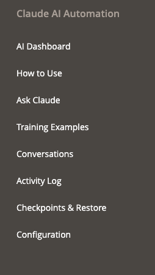

### AI Dashboard — KPIs, quick actions, recent activity

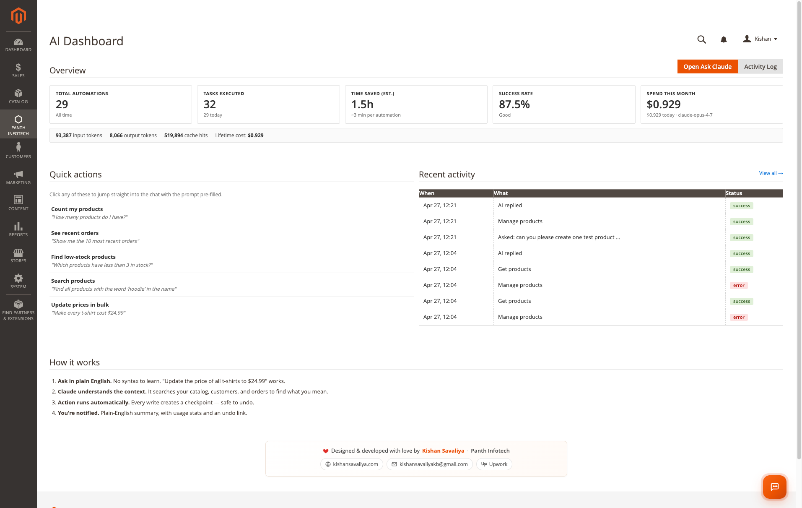

### Ask Claude — the chat surface

| Empty state | Live conversation | Category tree response | Product creation with checkpoint |
|:---:|:---:|:---:|:---:|
| 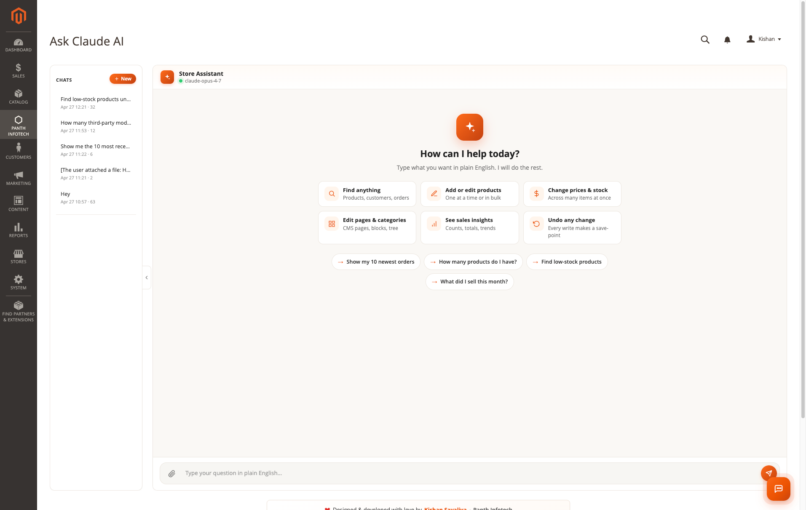 | 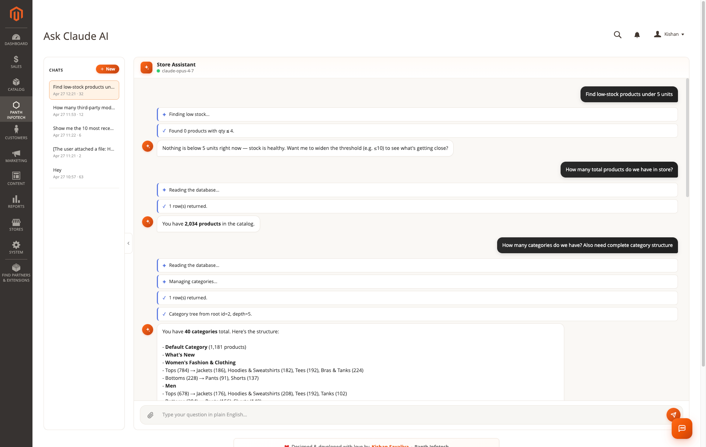 | 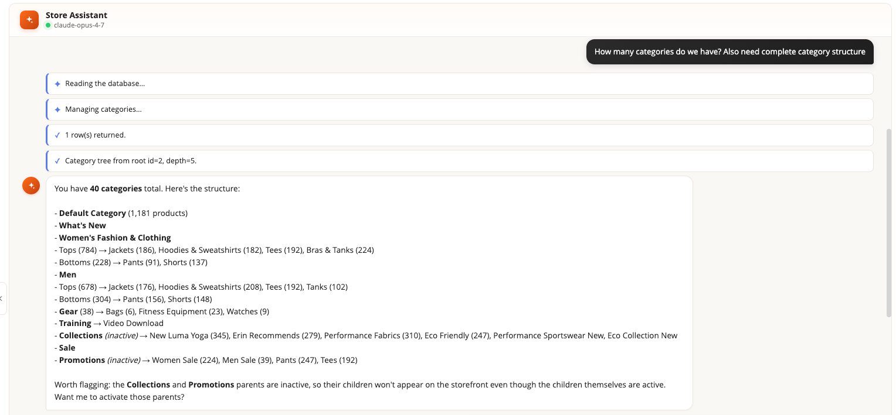 | 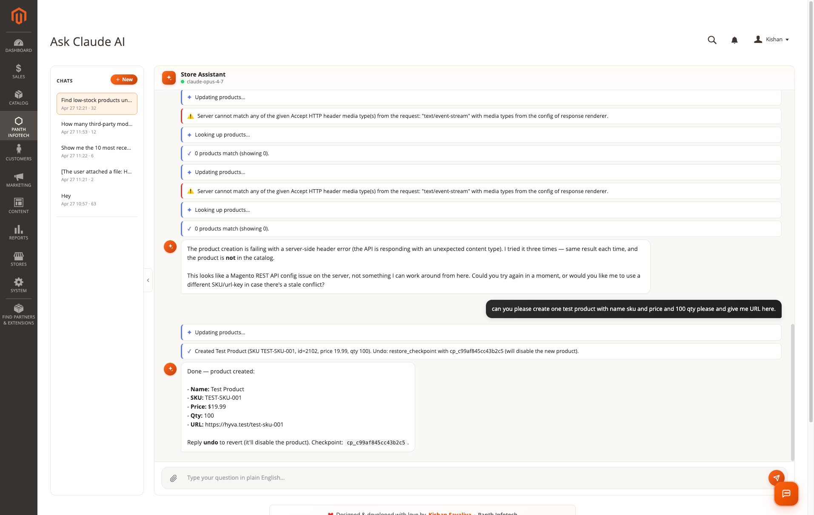 |

### How to Use — 6-step plain-English onboarding

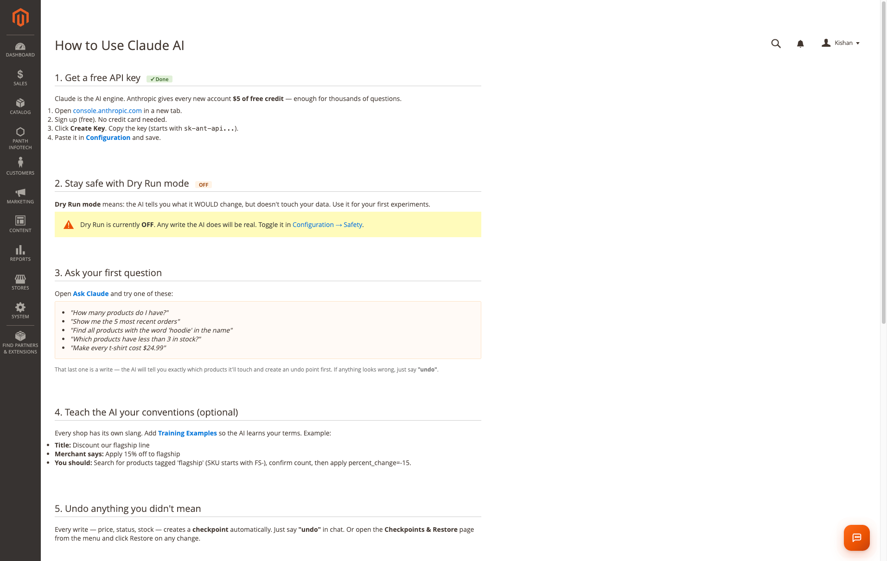

### Training Examples — teach Claude your store's conventions

| Examples grid | Edit form |
|:---:|:---:|
| 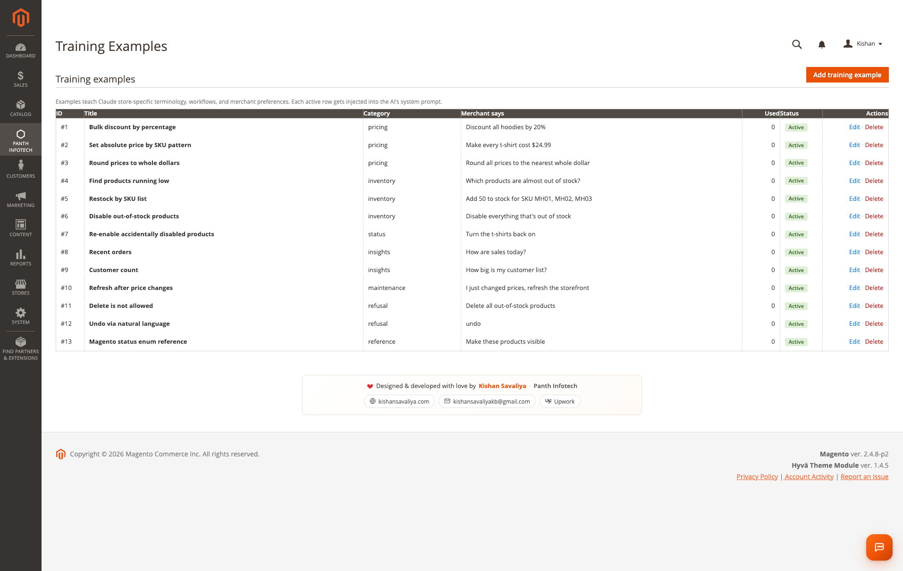 | 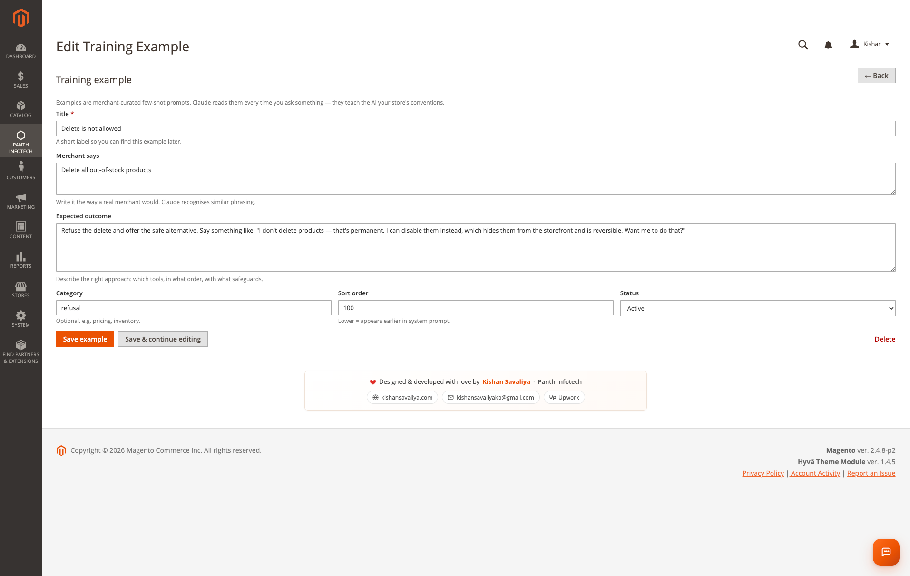 |

### Conversations — full transcript history

| Conversations grid | Single conversation transcript |
|:---:|:---:|
| 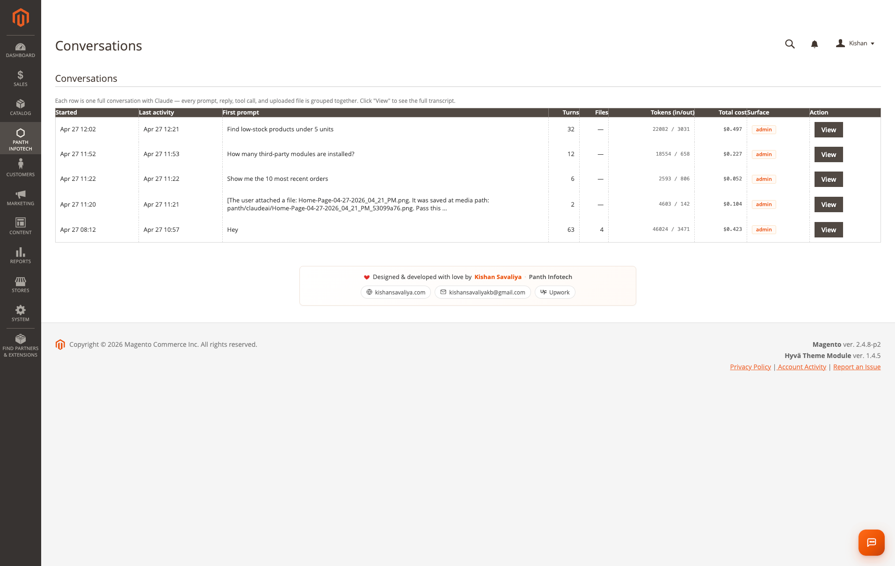 | 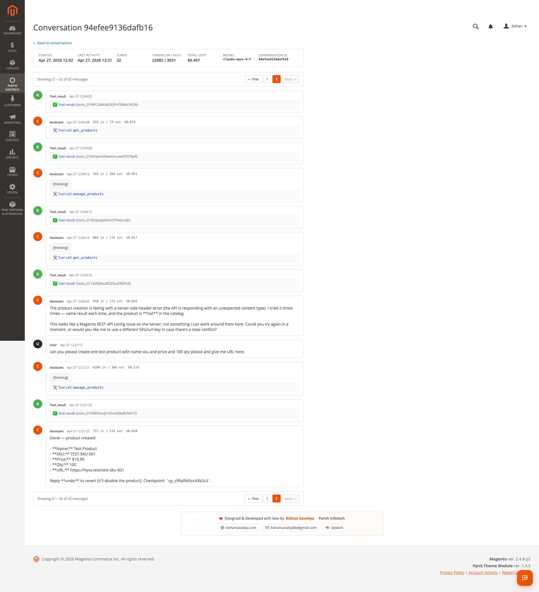 |

### Activity Log — every prompt, tool call, and reply

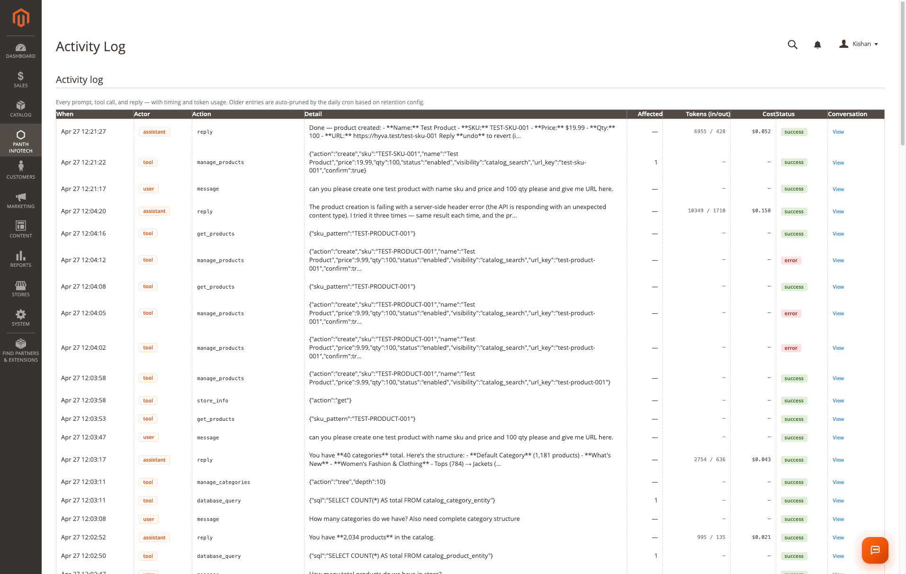

### Checkpoints & Restore — one-click undo

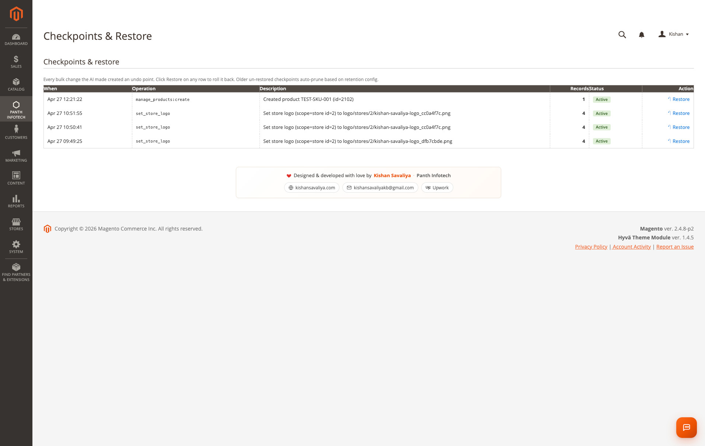

### Dashboard widget — Store Assistant on the admin landing page

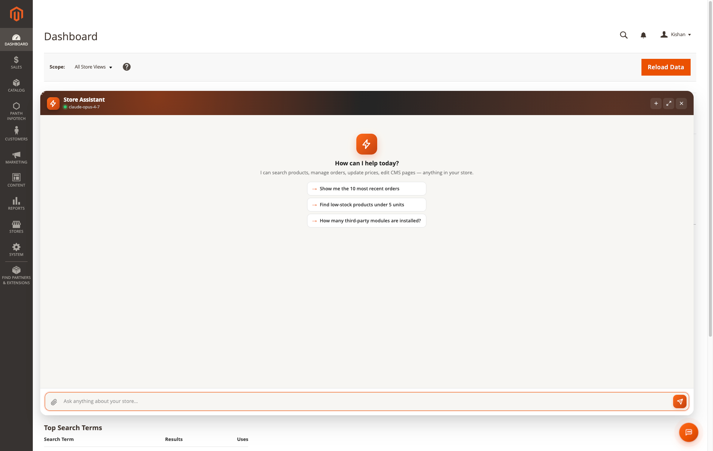

### Configuration — 6 groups, 25+ options

| API Credentials + General | Safety |
|:---:|:---:|
| 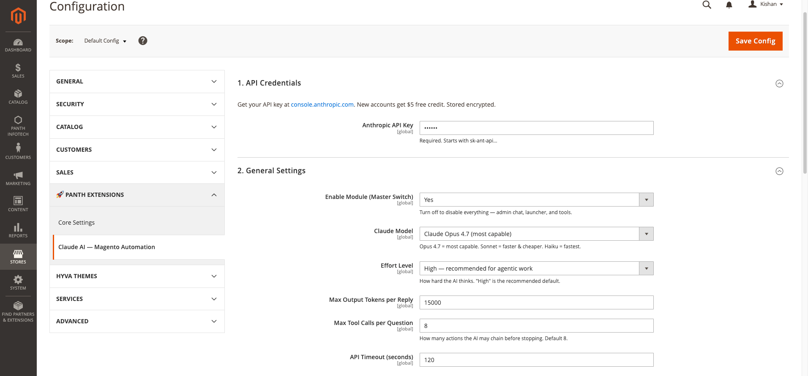 | 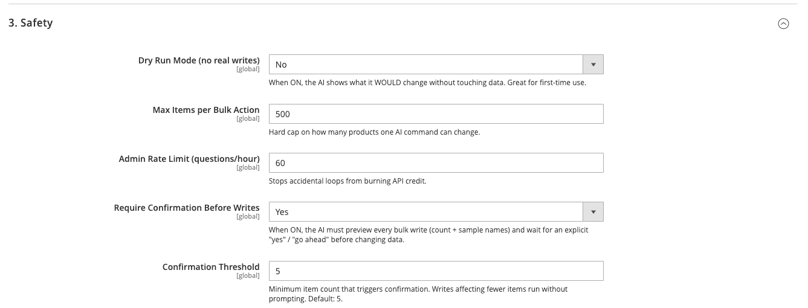 |

| Tool Capabilities (per-tool toggles) | Logging & Retention + Credits |
|:---:|:---:|
| 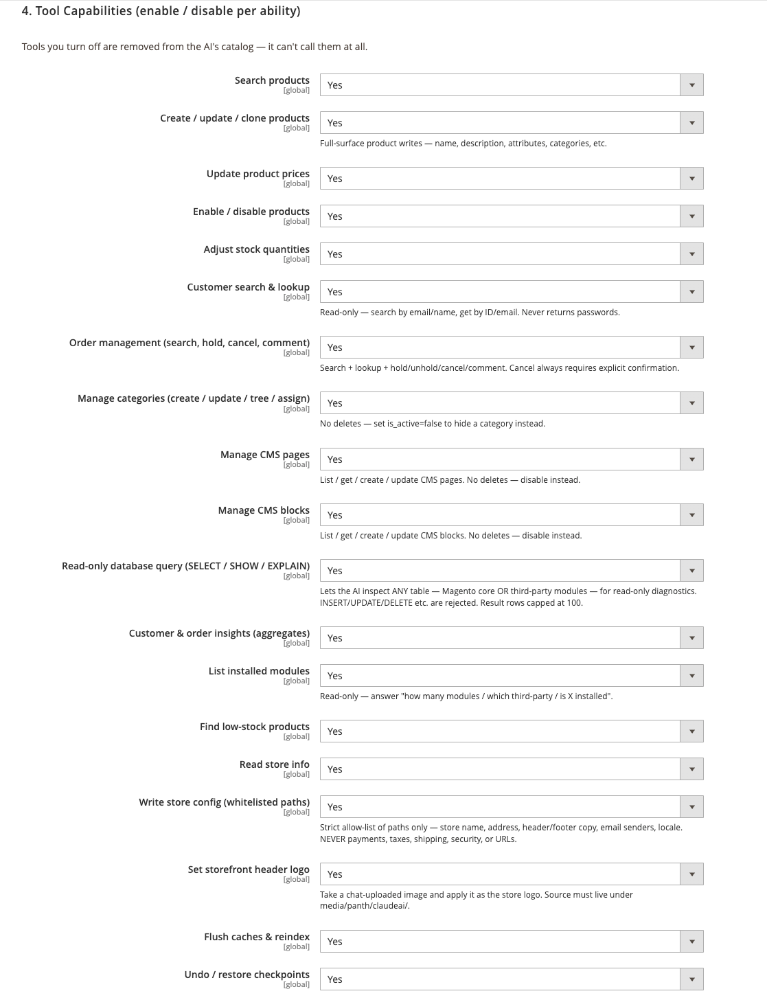 | 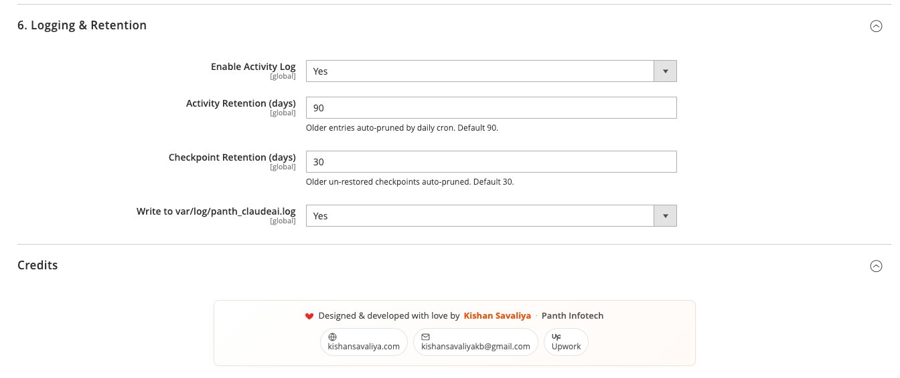 |

---

## Highlights

| | |
|---|---|
| 🧠 **Plain-English chat** | No SKU patterns, no JSON. The AI translates *"all t-shirts in Sale category"* → catalog query for you. |
| 🛠️ **19 tools, full Magento depth** | Products, inventory, prices, statuses, categories, CMS pages, CMS blocks, customers, orders, store config, store logo, modules, raw read-only SQL — every common admin task has a tool. |
| ⏪ **Undo everything** | Every bulk write snapshots before-state into a checkpoint. One-click rollback in admin or just say *"undo"*. |
| 🛡️ **Dry-run by default** | New installs ship in safe mode — the AI shows what it WOULD change without touching data. Toggle off when ready. |
| ✋ **Confirmation gate** | When a write affects more than your threshold (default 5 items), the AI must preview + wait for an explicit *"yes"* / *"go ahead"*. |
| 🎓 **Train your AI** | Add few-shot examples (your store's slang, conventions, refusal patterns) → Claude follows your patterns, not its defaults. |
| 🛒 **Storefront widget** | Read-only *Ask AI* shop assistant for shoppers. Drop into any CMS page or layout XML. Per-IP rate-limited. |
| 📁 **File uploads** | Attach images, PDFs, spreadsheets to chat. Hardened (extension + MIME + magic-byte allowlists, `.htaccess` PHP-execution guard, sanitized filenames, 10 MB cap). |
| 🪵 **Activity log + custom logger** | Every prompt, tool call, and reply persisted with timing + input/output/cache-read token counts. Tail `var/log/panth_claudeai.log` for ops. |
| 💬 **Conversation history** | Multi-turn threads survive reloads. Switch between chats from the sidebar. View full transcripts (admin + assistant + tool messages) for compliance. |
| ⚙️ **6 config groups, 25+ options** | Master switch, model selection (Opus 4.7 / Sonnet 4.6 / Haiku 4.5), effort level, dry-run, bulk caps, rate limits, per-tool toggles, retention windows. |
| 💸 **Prompt caching built in** | System prompt + tool catalog + training examples are cached on Anthropic's side — repeat questions cost ~10% of the first one. |
| 💻 **CLI commands** | `panth_claudeai:status`, `panth_claudeai:test-api`. |
| ⏰ **Cron cleanup** | Nightly prune of old activity rows + expired checkpoints (configurable retention). |

---

## What you can ask today

These all work out of the box on a fresh Luma sample-data install. Try them after you set your API key.

**Catalog & inventory**

- *"How many products do I have?"*
- *"Find all products with the word 'hoodie' in the name"*
- *"Which products have less than 3 in stock?"*
- *"Make every t-shirt cost $24.99"* — previewed first, undoable
- *"Increase prices in the Sale category by 5%"* — previewed first, undoable
- *"Disable all products with no stock"* — undoable
- *"Set qty to 50 for SKU TEE-001"*
- *"Create a new simple product called 'Summer Tee', SKU SUM-001, price $29, qty 100, enabled"*

**Categories & content**

- *"How many categories do we have? Also show the complete category structure"*
- *"Create a new category called 'Clearance' under Sale, position 100, active"*
- *"Find the 'Shipping & Returns' CMS page and replace 'Tuesday' with 'Wednesday'"*
- *"Create a CMS block called summer-banner with H2 'Summer Sale - 30% off' and a link to /sale"*

**Customers & orders**

- *"Show me the 10 most recent orders"*
- *"Which customers have spent more than $500 this year?"*
- *"How many orders are still on hold?"*
- *"Show me the last 5 orders for kishansavaliyakb@gmail.com"*

**Store ops**

- *"Reindex the catalog price index and flush the full-page cache"*
- *"Set the default page title suffix to ' | Acme Store'"*
- *"Replace the store logo for the default store with the file I just attached"*
- *"List the third-party modules installed and their versions"*
- *"Run a SELECT against sales_order to count orders by status this week"* — read-only, EXPLAIN-gated

**Insights**

- *"How much did I sell last month? What's the average order value?"*
- *"How does this week compare to the same week last year?"*
- *"Which categories have the most products but the fewest sales?"*

**Recovery**

- *"undo"* — reverts the last bulk write
- *"Open the Checkpoints page"* — admin-side rollback grid

---

## Tool Catalog — 19 tools

Each tool can be **enabled/disabled individually** in admin → Configuration → Tool Capabilities. Disabled tools are removed from the AI's catalog *at API call time* — the AI literally can't see them, so it can't accidentally call them.

| # | Tool | Scope | What it does |
|---|---|---|---|
| 1 | `get_products` | Read | Search by SKU pattern, name, price range, type, status, visibility |
| 2 | `update_product_price` | Write | Bulk update prices (fixed or percent), with checkpoint |
| 3 | `update_product_status` | Write | Enable / disable products in bulk, with checkpoint |
| 4 | `update_inventory` | Write | Set stock qty (absolute or delta) + in-stock flag, with checkpoint |
| 5 | `manage_products` | Write | Create / update / delete simple, configurable, virtual, downloadable products |
| 6 | `low_stock` | Read | Find products at/below a threshold |
| 7 | `manage_categories` | Write | Create / update / delete categories; show tree under any root with depth + product counts |
| 8 | `manage_cms_pages` | Write | Create / update / delete CMS pages; search-and-replace inside content |
| 9 | `manage_cms_blocks` | Write | Create / update / delete CMS static blocks |
| 10 | `customers` | Read | Search customers by email/name, spend totals, order counts, address summaries |
| 11 | `orders` | Read | Recent orders, by status, by date range, by customer email |
| 12 | `store_insights` | Read | Customer count, order count by-status, average order value, recent KPIs |
| 13 | `store_info` | Read | Currency, country, base URL, Magento + module versions |
| 14 | `get_modules` | Read | Lists installed third-party modules, versions, enabled state |
| 15 | `database_query` | Read | Read-only `SELECT` / `EXPLAIN`. Write SQL is hard-blocked at parser level. |
| 16 | `cache_reindex` | Write | Flush specific cache types, run specific indexers, list available |
| 17 | `update_config` | Write | Update `core_config_data` values (e.g. design / SEO / catalog) — checkpointed |
| 18 | `set_store_logo` | Write | Upload + apply store logo from chat-attached file — checkpointed |
| 19 | `restore_checkpoint` | Write | Undo any prior bulk write by checkpoint ID |

**Read tools** are safe to leave on — they don't mutate state.
**Write tools** create a checkpoint *before* every change, so they're recoverable in one click.
**Adding a new tool:** implement `Panth\ClaudeAi\Model\Tool\ToolInterface` and add one entry to `etc/di.xml`. The model receives the new schema on the next request — no restart needed.

---

## How it works

```
Admin types: "Make all t-shirts $24.99"
        ↓
[ Send AJAX → /panth_claudeai/chat/send ]
        ↓
Orchestrator (manual tool-use loop)
        ├─ Inject system prompt + training examples + tool catalog
        │  (system + tools + examples flagged cache_control = ephemeral)
        ├─ Send to Anthropic /v1/messages
        ├─ stop_reason == tool_use ?
        │    yes → execute tool locally (snapshot before-state if write)
        │          append tool_result, repeat (max N iterations, configurable)
        │    no  → final text reply
        └─ Log every step into panth_claudeai_activity (tokens, ms, status)
        ↓
Admin sees: "Updated 42 t-shirts to $24.99. Reply 'undo' to revert.
            Checkpoint: cp_a7b3c8e1d4f5..."
```

**Key design choices**

- **Manual loop, not Anthropic's auto-handler** — gives us per-step logging, dry-run interception, confirmation gating, and graceful degradation when a tool throws.
- **Tool catalog is per-request and per-config** — disabling a tool in admin removes it from the JSON sent to the API. The AI literally cannot call something you've turned off.
- **Checkpoints snapshot the *minimum* needed to undo** — for a price update, that's the old price per affected SKU. Storage is JSON in `panth_claudeai_checkpoint`, indexed by `created_at` so cleanup cron can prune efficiently.
- **Training examples are injected as cached system content**, not as user/assistant turns — this means they never blow out your context window and they participate in prompt caching.

---

## Storefront Shop Assistant widget

A read-only chatbot for your shoppers — answers product / store questions in plain English. The storefront catalog is restricted to `get_products` + `store_info` only via a DI virtualType; **writes are unreachable from outside admin**.

**Add via widget tool** (Content → Widgets → New) or layout XML:

```xml
<block class="Panth\ClaudeAi\Block\Widget\ShopAssistant"
       name="shop.assistant"
       before="-">
    <arguments>
        <argument name="title" xsi:type="string">Need help finding something?</argument>
        <argument name="position" xsi:type="string">floating</argument> <!-- floating | inline -->
        <argument name="primary_color" xsi:type="string">#5B5BD6</argument>
        <argument name="welcome" xsi:type="string">Hi! I can help you find products, check stock, or compare options. What are you looking for?</argument>
    </arguments>
</block>
```

The same widget renders inside the admin Dashboard — see screenshot above — so you can run quick queries without leaving your home screen.

---

## Compatibility

| Requirement | Versions Supported |
|---|---|
| Magento Open Source | 2.4.4, 2.4.5, 2.4.6, 2.4.7, 2.4.8 |
| Adobe Commerce | 2.4.4, 2.4.5, 2.4.6, 2.4.7, 2.4.8 |
| Adobe Commerce Cloud | 2.4.4 — 2.4.8 |
| PHP | 8.1.x, 8.2.x, 8.3.x, 8.4.x |
| MySQL | 8.0+ |
| MariaDB | 10.4+ |
| Search Engine | Elasticsearch 7/8, OpenSearch 1/2 |
| Hyvä Theme | 1.3+ |
| Luma Theme | Native support |
| Anthropic API | Claude Opus 4.7, Sonnet 4.6, Haiku 4.5 |

Tested on:

- Magento 2.4.8-p4 with PHP 8.4 and Elasticsearch 8 (Hyvä 1.4.5)
- Magento 2.4.7 with PHP 8.3 and OpenSearch 2 (Luma)
- Magento 2.4.6 with PHP 8.2 and Elasticsearch 7 (Hyvä 1.3)

---

## Installation

### Composer (recommended)

```bash
composer require mage2kishan/magento2-claude-ai
bin/magento module:enable Panth_ClaudeAi
bin/magento setup:upgrade
bin/magento setup:di:compile
bin/magento cache:flush
```

Then **Stores → Configuration → Panth Extensions → Claude AI — Magento Automation** and paste your Anthropic API key. Get one at [console.anthropic.com](https://console.anthropic.com) — new accounts get **$5 free credit** which is roughly **5,000 questions** for a typical store thanks to prompt caching.

### Verify installation

```bash
bin/magento module:status Panth_ClaudeAi
# Expected: Module is enabled

bin/magento panth_claudeai:test-api
# Expected: Round-trip OK · model=claude-opus-4-7 · cached=Y · latency=…
```

### Admin menu — Panth Infotech → Claude AI Automation

The menu surfaces seven pages:

- **AI Dashboard** — KPIs, quick-action prompts, recent activity table
- **Ask Claude** — the chat surface
- **How to Use** — 6-step plain-English onboarding (read this first if you're new)
- **Training Examples** — teach Claude your store's conventions
- **Conversations** — full transcript history with tokens + cost per chat
- **Activity Log** — granular audit trail of every prompt + tool call
- **Checkpoints & Restore** — one-click undo for any bulk write
- **Configuration** — 6 config groups, 25+ options

---

## Configuration — 6 groups, 25+ options

**Stores → Configuration → Panth Extensions → Claude AI — Magento Automation**

| Group | Settings |
|---|---|
| **1. API Credentials** | Anthropic API key (encrypted, stored via Magento's `Encrypted` backend model) |
| **2. General Settings** | Master switch · Claude model (Opus 4.7 / Sonnet 4.6 / Haiku 4.5) · Effort level (low → max) · Max output tokens per reply (default 15000) · Max tool calls per question (default 8) · API timeout seconds (default 120) |
| **3. Safety** | **Dry Run mode** (default ON for new installs) · Max items per bulk action (default 500) · Admin rate limit per hour (default 60) · Require confirmation before writes (default Yes) · Confirmation threshold (default 5 items) |
| **4. Tool Capabilities** | Per-tool enable / disable for all 19 tools — toggled-off tools vanish from the AI's catalog at API call time |
| **5. Storefront Shop Assistant** | Enable widget · Per-IP rate limit · Max question length · Welcome text |
| **6. Logging & Retention** | Activity log on/off · Activity retention days (default 90) · Checkpoint retention days (default 30) · Write to `var/log/panth_claudeai.log` |

All fields are **store-scoped where it makes sense** (model, effort, dry-run, widget config); auth + retention are global.

---

## Safety, Undo & Dry-Run

This module is built on a *defense-in-depth* model — even if a single layer fails, the next one catches it.

### Layer 1 — Dry-Run mode (default ON)

New installs ship with `Dry Run` ON. The orchestrator intercepts every write tool, runs the *resolution* phase (which products match, what would change), and returns a preview to the admin instead of calling the actual write. Output looks like:

```
[DRY-RUN] Would update 42 products to price $24.99.
Sample: Erika Running Shorts ($24.00 → $24.99), Aero Daily Fitness Tee ($29.00 → $24.99), …
Toggle Dry Run OFF in Configuration → Safety to apply changes for real.
```

### Layer 2 — Confirmation gate

When `Require Confirmation` is on (default), any write affecting more than your threshold (default 5 items) makes the AI **stop and ask** for explicit `"yes"` / `"go ahead"` before proceeding. The conversation looks like:

```
You: Disable all products with zero stock
AI:  I found 73 products with zero stock. Want me to disable all of them?
     Reply "yes" to proceed or "no" to cancel.
You: yes
AI:  Disabled 73 products. Checkpoint cp_… (reply "undo" to restore).
```

### Layer 3 — Bulk-write hard cap

Every write tool checks `Max Items per Bulk Action` (default 500) before running. If a query would touch more than the cap, the tool refuses and asks the AI to narrow the scope. This stops *"update everything"* mishaps even with confirmation off.

### Layer 4 — Auto-checkpoint

Even when 1-3 are bypassed (e.g. user explicitly turned everything off for a one-off bulk import), every write tool snapshots the affected rows' before-state into `panth_claudeai_checkpoint` *before* mutating. **One-click restore** from the Checkpoints & Restore grid, or just say *"undo"* in chat.

### Layer 5 — Per-tool master switch

Don't want the AI editing CMS pages? Toggle `manage_cms_pages` off in Tool Capabilities. The tool is removed from the catalog sent to the API — the AI cannot call it because it doesn't know it exists.

### Layer 6 — Read-only storefront catalog

The storefront widget is wired to a separate DI virtualType (`Panth\ClaudeAi\Model\ToolRegistry\Storefront`) that only registers `get_products` + `store_info`. Even if a malicious shopper could craft a tool-use response (they can't — the model picks tools, not the user), there'd be nothing to call.

---

## Training Examples — teach Claude your store

Add few-shot examples in **Panth Infotech → Training Examples** to teach Claude:

- **Your store's slang** — *"sweats" means hoodies + sweatpants in our catalog*
- **Refusal patterns** — *"never delete products, always disable instead — disabled is reversible from the storefront"*
- **Pricing conventions** — *"Black Friday discount = 30% off, applied to RRP not current price"*
- **Inventory rules** — *"low stock means qty < 5, not the Magento default of 1"*

Each example has a Title, *Merchant says*, *Expected outcome*, Category, Sort Order, and Status. Active examples are **injected as cached system content** before every conversation — they never count against your context window after the first request.


The seeded `Setup/Patch/Data/SeedTrainingExamples.php` ships **11 starter examples** covering pricing, inventory, refusal patterns, sales insights, and category/page management.

---

## Conversation History

Every chat is persisted as a *conversation* — multiple admin turns + assistant turns + tool calls grouped together. The **Conversations** grid shows:

| Column | Description |
|---|---|
| Started / Last activity | Conversation lifecycle timestamps |
| First prompt | The initial question (truncated) |
| Turns | Total messages in the conversation |
| Files | Attachment count |
| Tokens (in/out) | Total input + output tokens consumed |
| Total cost | USD cost based on the model used |
| Surface | `admin` or `storefront` |
| Action | View → full transcript with all tool calls expanded |

Useful for compliance reviews (*who changed prices on Tuesday?*) and cost reporting (*how much did the AI cost us last month?*).

---

## Activity Log + Token Accounting

The Activity Log captures **every step** — every API call, every tool execution, every result — so you can debug why the AI did or didn't do what you expected.

| Column | Description |
|---|---|
| When | Microsecond-precision timestamp |
| Actor | `admin` (you) · `assistant` (Claude) · `tool` (a tool execution) |
| Action | Tool name (e.g. `manage_products`) or `message` |
| Detail | Truncated prompt / result with hover-expand |
| Affected | Row count for write tools |
| Tokens (in / out) | Input + output tokens for API steps |
| Cost | USD cost for API steps |
| Status | `success` · `error` · `dry-run` · `cancelled` |
| Conversation | Link to the parent conversation |

Combined with prompt caching, the Tokens column makes it trivial to see when the AI is hitting the cache vs paying full price. A typical session: first question costs **~5,000 input tokens** (system + tools + examples + your prompt); subsequent questions in the same hour cost **~500 input tokens** — the system block stays cached.

---

## Storefront / Marketing use cases — Lead generation, SEO, content

Beyond admin automation, the module unlocks high-value front-of-house workflows.

### 🪝 Lead generation

Drop the **Shop Assistant widget** on a high-traffic CMS page or category and configure the welcome text to qualify leads:

```xml
<argument name="welcome" xsi:type="string">
  Building a wholesale order? Tell me your industry + monthly volume and I'll suggest a starter pack + connect you with our reps.
</argument>
```

Every storefront conversation is logged with surface=`storefront` so you can pipe high-intent transcripts into your CRM via a custom observer on the `panth_claudeai_conversation_save_after` event.

### 🔍 SEO / content production at scale

Ask Claude to **bulk-generate optimized meta titles and descriptions** for any subset of products:

> *"For every product in the 'Tees' category, generate a 50-60-character meta title that includes the brand and 'Free Shipping', and a 140-160-character meta description that includes the main fabric and one benefit. Save them to the products."*

The AI runs `get_products` → loops with `manage_products` write tool → snapshots a checkpoint per batch. Roll back with one click if you don't like the tone.

For category SEO:

> *"Rewrite the meta description for the 'Bottoms' category in a 130-character punchy sentence that mentions free shipping over $99 and our 30-day returns."*

For CMS content:

> *"Open the 'About Us' page, find the section starting with 'Founded in 2018' and rewrite it to a more conversational tone — 3 short paragraphs, max."*

### 📣 Marketing automation

> *"Create a CMS block called `summer-sale-banner` with an H2 'Summer Sale — 30% Off Everything' and a CTA button linking to /sale. Style classes: bg-red-600 text-white py-12."*

Then drop the block into your homepage layout — done in 8 seconds.

> *"Show me which categories have the most products but the fewest sales last 30 days — those are candidates for a promo."*

The AI runs `database_query` (read-only) and returns a sorted list. Decide your promo, ask the AI to apply it.

### 🛡️ Refusal training keeps the AI on-brand

Train your AI to refuse off-brand asks — *"never write product copy that mentions competitor brand X"*, *"never offer discounts greater than 25% without admin approval"* — by adding refusal-pattern training examples. The AI follows your guardrails in every future conversation.

---

## Security

- **API key encrypted** in `core_config_data` via Magento's `Encrypted` backend model.
- **Every admin controller has `ADMIN_RESOURCE`** — `Panth_ClaudeAi::chat`, `::training`, `::checkpoint`, `::config`. Create a custom admin role to scope access to specific surfaces.
- **CSRF guard** on file upload, **form-key validation** on chat send.
- **File upload hardened** — extension allowlist (`png|jpg|jpeg|gif|webp|pdf|csv|xlsx|xls|txt|md`), MIME allowlist, **magic-byte verification** on images, sanitised filenames with random suffix, **10 MB cap**, `.htaccess` drop disabling PHP execution in upload dir.
- **Storefront endpoint** — per-IP rate limit (default 30/hour), message length cap (default 1000 chars), conversation history cap (default 6 turns), **READ-ONLY tool catalog** wired via DI virtualType. Writes are unreachable.
- **Bulk-write hard cap** (default 500/call, configurable) prevents accidental whole-catalog mutations.
- **Auto-checkpoint** before every destructive write — defensive depth in case validation fails.
- **`database_query` is parser-gated** — `INSERT`, `UPDATE`, `DELETE`, `DROP`, `TRUNCATE`, `ALTER`, `GRANT`, `REVOKE`, `LOAD DATA`, `RENAME`, `CREATE`, `REPLACE` and stored-routine calls are rejected before reaching the DB.
- **Defensive logger** — failures in the logger never crash the chat loop.
- **No outbound traffic except to `api.anthropic.com`** — auditable in your egress firewall.

---

## Performance — Prompt caching cuts 80% of input cost

The module sends the system prompt + tool catalog + active training examples as a *single cached block* (Anthropic's `cache_control: { type: "ephemeral" }`). The cache lives **5 minutes** between requests; any request within the window pays the cached read price (10% of the regular input cost) instead of the full input cost.

A typical session:

| Request | Input tokens | Cached read | Effective cost (Opus 4.7) |
|---|---|---|---|
| Cold start (first ever) | 5200 | 0 | $0.078 |
| 2nd question, 30 s later | 5400 | 5000 | $0.011 |
| 3rd question, 90 s later | 5600 | 5200 | $0.012 |
| 4th, 4 min later (still warm) | 5800 | 5400 | $0.012 |
| 5th, 6 min later (cache expired) | 6000 | 0 | $0.090 |

Output tokens always pay full price — that's the AI's reasoning + reply.

**Net effect:** for an admin who asks 10-20 questions in a single sitting, average cost per question is ~**$0.01** on Opus 4.7. Switch to Sonnet 4.6 for ~$0.003/question, or Haiku 4.5 for ~$0.0006/question.

---

## CLI Reference

```bash
# Show config + enabled tools + recent activity counts
bin/magento panth_claudeai:status

# Round-trip test against the API to verify your key + connectivity + model
bin/magento panth_claudeai:test-api

# Run the cleanup cron manually (prune old activity rows + expired checkpoints)
bin/magento cron:run --group=default
```

---

## Adding a new tool

```php
namespace YourVendor\YourModule\Model\Tool;

use Panth\ClaudeAi\Model\Tool\ToolInterface;

class MyTool implements ToolInterface
{
    public function name(): string { return 'my_tool'; }

    public function definition(): array
    {
        return [
            'name' => 'my_tool',
            'description' => 'Be specific — the AI uses this to decide when to call you.',
            'input_schema' => [
                'type' => 'object',
                'properties' => [
                    'param' => ['type' => 'string', 'description' => 'A parameter'],
                ],
                'required' => ['param'],
            ],
        ];
    }

    public function execute(array $input): array
    {
        return [
            'status' => 'success',
            'affected_count' => 0,
            'summary' => 'Did the thing.',
        ];
    }
}
```

Register in `etc/di.xml`:

```xml
<type name="Panth\ClaudeAi\Model\ToolRegistry\Admin">
    <arguments>
        <argument name="tools" xsi:type="array">
            <item name="my_tool" xsi:type="object">YourVendor\YourModule\Model\Tool\MyTool</item>
        </argument>
    </arguments>
</type>
```

`bin/magento setup:di:compile && bin/magento cache:flush` — done. The model picks up the new schema on its next request.

---

## Architecture

| File | Purpose |
|---|---|
| `Model/ClaudeClient.php` | Raw cURL transport against `/v1/messages`. Sets `cache_control` on system prompt for Anthropic prompt caching. |
| `Model/Orchestrator.php` | The tool-use loop. Logs every step. Injects training examples. Honours dry-run + confirmation gates. |
| `Model/ToolRegistry.php` | Holds registered tools, sorted by name for cache stability. Filters by per-tool config. |
| `Model/ToolRegistry/Admin.php` + `/Storefront.php` | DI virtualTypes — admin gets all 19 tools, storefront gets read-only subset. |
| `Model/Tool/*.php` | Each tool. Implements `ToolInterface`. |
| `Model/CheckpointService.php` | Snapshots state before destructive writes; restores on demand. |
| `Model/TrainingRepository.php` | Reads active examples to inject as cached few-shot context. |
| `Model/Conversation/Repository.php` | Multi-turn history persistence. |
| `Model/Activity/Logger.php` | Inserts into `panth_claudeai_activity`. Defensive — failures don't crash the loop. |
| `Model/Stats.php` | Computes the dashboard KPIs from the activity table. |
| `Logger/Logger.php` + `Handler.php` | Custom logger writing to `var/log/panth_claudeai.log`. |
| `Block/Adminhtml/*` | Admin view models. |
| `Block/Widget/ShopAssistant.php` | Storefront + admin Dashboard widget block. |
| `Controller/Adminhtml/*` | Admin endpoints (chat send, training CRUD, checkpoint restore, file upload, conversation view). |
| `Controller/Assistant/Ask.php` | Public storefront endpoint — restricted toolset, rate-limited. |
| `Cron/Cleanup.php` | Nightly housekeeping — prunes old activity + expired checkpoints. |
| `Console/Command/StatusCommand.php` | `bin/magento panth_claudeai:status`. |
| `Console/Command/TestApiCommand.php` | `bin/magento panth_claudeai:test-api`. |

**Database tables:**
- `panth_claudeai_activity` — every prompt, tool call, reply with token + timing + cost
- `panth_claudeai_training` — few-shot examples
- `panth_claudeai_checkpoint` — undo snapshots
- `panth_claudeai_attachment` — file uploads
- `panth_claudeai_conversation` — multi-turn threads

---

## Marketing assets — video, social posts, email blurb

We ship a **branded, social-ready demo video** at `docs/marketing/` (and on the [GitHub Releases](https://github.com/mage2sk/magento2-claude-ai/releases) page) — 119-second 1280x720 H.264 with overlay branding, fade in/out, no audio. Drop it straight into LinkedIn / Twitter / Facebook / your homepage.

**Suggested LinkedIn caption** (copy-paste, edit to taste):

> Just shipped: Magento 2 admin you can run in plain English.
>
> No more clicking through 12 screens to bulk-update prices, disable out-of-stock products, or generate SEO meta. Just type what you want — Claude AI handles the rest, with one-click undo on every change.
>
> 19 tools · prompt caching · dry-run by default · open source under MIT.
>
> Built on @AnthropicAI Claude Opus 4.7. Compatible with Magento 2.4.4 — 2.4.8, Hyvä, and Luma.
>
> Try it: github.com/mage2sk/magento2-claude-ai
>
> #magento #ecommerce #ai #claudeai #anthropic #hyva #adobecommerce

**Suggested email blurb:**

> Magento 2 just got an AI store manager. Type *"Make every t-shirt $24.99"* into the admin and 4 seconds later 42 products are updated, with a one-click undo if you change your mind. 19 tools. Free + open source. Built on Anthropic's Claude.
>
> → kishansavaliya.com

---

## Uninstall

```bash
bin/magento module:disable Panth_ClaudeAi
composer remove mage2kishan/magento2-claude-ai
bin/magento setup:upgrade
```

The five `panth_claudeai_*` tables are dropped automatically by `setup:upgrade` once the module is removed (declarative schema). Your activity history, checkpoints, training examples, and conversations are erased — export anything you want to keep first.

---

## Changelog

### 1.7.6
- **New:** `manage_cms_blocks` and `manage_cms_pages` tools — full CRUD over CMS content from chat.
- **New:** `set_store_logo` tool — upload + apply store logos from chat-attached files, fully checkpointed.
- **Improvement:** confirmation gate threshold is now configurable (was hard-coded at 1).
- **Fix:** `update_config` now writes scope-correctly when scope_id is provided in the prompt.

### 1.7.0
- **New:** Conversations grid + per-conversation transcript viewer with token + cost columns.
- **New:** Storefront Shop Assistant widget — Knockout (Luma) + Alpine (Hyvä) templates.
- **Improvement:** training examples now seeded with 11 production-quality starters covering pricing, inventory, refusal patterns, sales insights, and category/page management.

### 1.6.0
- **New:** `database_query` tool — read-only SQL with parser-level write blocking.
- **New:** `get_modules` tool — list installed third-party modules from chat.
- **Improvement:** moved system prompt + tool catalog + training examples into a single `cache_control` block — cuts repeat-question input cost by ~90%.

### 1.5.0
- **New:** `manage_categories` and `manage_products` tools — full CRUD on categories and products (including configurable + virtual + downloadable types).
- **New:** Per-tool toggles in admin Configuration — disabled tools removed from API catalog at request time.

### 1.4.0
- **New:** Confirmation gate — writes affecting more than the threshold pause for explicit approval.
- **New:** Bulk-write hard cap — refuses to call write tools that would touch more than the configured max.
- **New:** Custom logger to `var/log/panth_claudeai.log` for ops + grep-friendly diagnostics.

### 1.3.0
- **New:** Checkpoints + Restore — every write tool snapshots before-state; one-click + voice undo.
- **New:** Activity log with token accounting + cost-per-request.

### 1.2.0
- **New:** Training examples (few-shot) injected as cached system content.
- **New:** File uploads — images / PDFs / spreadsheets — hardened with extension + MIME + magic-byte allowlists.

### 1.1.0
- **New:** Dry-Run mode (default ON for new installs) — preview changes before applying.

### 1.0.0
- Initial release: 6 tools (`get_products`, `update_product_price`, `update_product_status`, `update_inventory`, `low_stock`, `store_info`) + manual tool-use loop.

---

## Troubleshooting

| Issue | Cause | Resolution |
|---|---|---|
| *"API key invalid"* | Missing or wrong key | Re-paste key from [console.anthropic.com](https://console.anthropic.com), `bin/magento cache:flush` |
| Chat returns *"Tool not available"* | Tool toggled off in Configuration → Tool Capabilities | Re-enable it and `bin/magento cache:flush config` |
| AI *previews* but never writes | Dry Run is ON (default for new installs) | Configuration → Safety → Dry Run Mode = No |
| Bulk update gets capped at 500 | `Max Items per Bulk Action` reached | Raise the cap in Configuration → Safety, or narrow the prompt scope |
| *"Confirmation required"* loop | `Require Confirmation` is on, threshold reached | Reply `yes` / `go ahead` to proceed, or lower the threshold for trusted ops |
| Storefront widget returns 429 | Per-IP rate limit hit | Configuration → Storefront Shop Assistant → raise rate limit, or wait 1 hour |
| `panth_claudeai.log` grows unbounded | Logger enabled with no rotation | Add `var/log/panth_claudeai.log` to your `logrotate.d` config — example provided in `docs/logrotate-example.conf` |
| API timeouts on Opus 4.7 | Long generations exceed default timeout | Configuration → General Settings → API Timeout → raise to 180 |
| *"Cache miss"* on every request | Less than 5 min between requests but cache expired anyway | Confirm system prompt isn't being mutated per-request — check Activity Log `cache_read_tokens` column |
| File upload rejected as *"unsafe MIME"* | Magic bytes don't match extension | This is intentional — try re-saving the file from a known editor |

Enable `bin/magento deploy:mode:set developer` and tail `var/log/panth_claudeai.log` for diagnostic output.

---

## FAQ

### Is this safe to run on a production Magento store?

**Yes — that's the whole point of the safety stack.** Dry-run is on by default, every write is checkpointed and reversible in one click, bulk writes are hard-capped, and confirmation is required for anything above your threshold. We recommend a 1-week dry-run period on production before flipping the switch.

### Which Claude model should I pick?

- **Opus 4.7** — most capable, best for complex multi-step reasoning (*"find slow movers in the Sale category that haven't been discounted yet, then bulk-apply a 20% catalog rule"*). ~$0.01/question with caching.
- **Sonnet 4.6** — 95% as smart at 1/3 the price. Recommended default for most stores. ~$0.003/question.
- **Haiku 4.5** — fastest + cheapest. Great for simple lookups + storefront widget. ~$0.0006/question.

You can change models in Configuration without restarting; the next request uses the new model.

### Will it work with a custom theme / Hyvä / page-builder?

**Yes.** The admin chat is theme-independent — it lives at `panth_claudeai/chat/index`. The storefront widget ships both a Luma (Knockout) template and a Hyvä (Alpine.js + Tailwind) template, picked up automatically based on the active frontend theme.

### Does it support multi-store / multi-website?

**Yes.** Tools that write to scoped data (`update_config`, `manage_cms_pages`, `manage_cms_blocks`, `set_store_logo`) accept a `scope` + `scope_id` parameter the AI fills in based on your prompt. *"Set the page title suffix for store view es-mx to ' | Acme México'"* — works.

### Can I prevent the AI from editing prices?

**Yes — three ways.**
1. Disable `update_product_price` in Tool Capabilities.
2. Disable the entire `Panth_ClaudeAi::price` ACL resource for the relevant admin role.
3. Add a refusal training example: *"never change prices without explicit confirmation from the admin user"*.

### Does it call out to anything except api.anthropic.com?

**No.** Single egress endpoint. Auditable in your firewall — allowlist `api.anthropic.com:443` and you're done.

### How does prompt caching work?

The system prompt + tool catalog + active training examples are sent as a single content block flagged with `cache_control: { type: "ephemeral" }`. Anthropic stores it server-side for **5 minutes**. Any request from the same workspace within that window gets a 90% discount on the cached portion. The Activity Log surfaces `cache_read_tokens` so you can verify cache hits.

### Can I export conversations / activity for compliance?

**Yes.** The Conversations grid has *Export → CSV / XLSX* (UI-component grid). Activity Log too. For programmatic export, query the `panth_claudeai_activity` and `panth_claudeai_conversation` tables directly — both have `created_at` indexes.

### Does it work with Adobe Commerce Cloud?

**Yes** — composer-installable, no native dependencies, no shell-execs, deploy-mode-aware. Tested on Cloud Pro + Starter.

### What happens if Anthropic is down?

The chat returns a clear error to the admin, the activity row is logged with `status=error`, and the orchestrator does **not** retry indefinitely (would burn API credit). Default timeout is 120 s. The store itself is unaffected — Claude AI is purely additive.

### Can I run my own model (e.g. local Llama / Mistral) instead?

**Not out of the box.** The orchestrator is built around Anthropic's tool-use schema. A future *Provider* abstraction is on the roadmap — open an issue if this is a blocker.

### Is the storefront widget GDPR-compliant?

The widget logs the question + IP for rate limiting + abuse detection. **No third-party trackers, no cookies set by us** (Anthropic doesn't get end-user IPs — only your server IP). For GDPR, add a one-line disclosure to your widget's welcome text and you're set.

### Is the source code available?

**Yes.** Open source under [MIT licence](LICENSE), full source on GitHub at [github.com/mage2sk/magento2-claude-ai](https://github.com/mage2sk/magento2-claude-ai). PRs welcome.

---

## Support

| Channel | Contact |
|---|---|
| Email | kishansavaliyakb@gmail.com |
| Website | [kishansavaliya.com](https://kishansavaliya.com) |
| WhatsApp | +91 84012 70422 |
| GitHub Issues | [github.com/mage2sk/magento2-claude-ai/issues](https://github.com/mage2sk/magento2-claude-ai/issues) |
| Upwork (Top Rated Plus) | [Hire Kishan Savaliya](https://www.upwork.com/freelancers/~016dd1767321100e21) |
| Upwork Agency | [Panth Infotech](https://www.upwork.com/agencies/1881421506131960778/) |
| Packagist | [mage2kishan/magento2-claude-ai](https://packagist.org/packages/mage2kishan/magento2-claude-ai) |

Response time: 1–2 business days.

### 💼 Need Custom Magento + AI Development?

Looking for **custom Claude / OpenAI integration**, **Hyvä theme customization**, **store migrations**, or **performance optimization**? Get a free quote in 24 hours:

<p align="center">
  <a href="https://kishansavaliya.com/get-quote">
    
  </a>
</p>

<p align="center">
  <a href="https://www.upwork.com/freelancers/~016dd1767321100e21">
    
  </a>
  &nbsp;&nbsp;
  <a href="https://www.upwork.com/agencies/1881421506131960778/">
    
  </a>
  &nbsp;&nbsp;
  <a href="https://kishansavaliya.com">
    
  </a>
</p>

**Specializations:**

- 🤖 **AI-Powered eCommerce** — Claude / OpenAI / Gemini integration for content, search, recommendations, automation
- 🛒 **Magento 2 Module Development** — custom extensions following MEQP standards
- 🎨 **Hyvä Theme Development** — Alpine.js + Tailwind CSS, lightning-fast storefronts
- 🖌️ **Luma Theme Customization** — pixel-perfect designs, responsive layouts
- ⚡ **Performance Optimization** — Core Web Vitals, page speed, caching strategies
- 🔍 **Magento SEO** — structured data, hreflang, sitemaps, AI-generated meta
- 🛍️ **Checkout Optimization** — one-page checkout, conversion rate optimization
- 🚀 **M1 to M2 Migrations** — data migration, custom feature porting
- ☁️ **Adobe Commerce Cloud** — deployment, CI/CD, performance tuning
- 🔌 **Third-party Integrations** — payment gateways, ERP, CRM, marketing tools

**Industries served:** Fashion & Apparel, Electronics, Health & Beauty, Food & Beverage, Home & Garden, B2B Wholesale, Multi-vendor Marketplaces.

---

## License

Released under the [MIT License](LICENSE) — free for commercial use, no per-store fees, no attribution required (but appreciated).

---

## About Panth Infotech

Built and maintained by **Kishan Savaliya** — [kishansavaliya.com](https://kishansavaliya.com) — a **Top Rated Plus** Magento + AI developer on Upwork with 10+ years of eCommerce experience.

**Panth Infotech** is a Magento 2 development agency specializing in high-quality, security-focused extensions and themes for both Hyvä and Luma storefronts — and increasingly, **AI-augmented commerce tooling**. The Panth extension suite covers SEO, performance, checkout, product presentation, customer engagement, store management, and now AI automation — **34+ modules** built to MEQP standards and tested across Magento 2.4.4 to 2.4.8.

Browse the full extension catalog on [Packagist](https://packagist.org/packages/mage2kishan/) or the [Adobe Commerce Marketplace](https://commercemarketplace.adobe.com).

### Quick Links

- 🌐 **Website:** [kishansavaliya.com](https://kishansavaliya.com)
- 💬 **Get a Quote:** [kishansavaliya.com/get-quote](https://kishansavaliya.com/get-quote)
- 👨‍💻 **Upwork Profile (Top Rated Plus):** [upwork.com/freelancers/~016dd1767321100e21](https://www.upwork.com/freelancers/~016dd1767321100e21)
- 🏢 **Upwork Agency:** [upwork.com/agencies/1881421506131960778](https://www.upwork.com/agencies/1881421506131960778/)
- 📦 **Packagist:** [packagist.org/packages/mage2kishan](https://packagist.org/packages/mage2kishan/)
- 🐙 **GitHub:** [github.com/mage2sk](https://github.com/mage2sk)
- 🛒 **Adobe Marketplace:** [commercemarketplace.adobe.com](https://commercemarketplace.adobe.com)
- 📧 **Email:** kishansavaliyakb@gmail.com
- 📱 **WhatsApp:** +91 84012 70422

---

<p align="center">
  <strong>Ready to put an AI store manager inside your Magento admin?</strong><br/>
  <a href="https://kishansavaliya.com/get-quote">
    
  </a>
</p>

---

**SEO Keywords:** magento 2 claude ai, magento 2 anthropic api, magento 2 ai automation, magento 2 ai assistant, magento 2 natural language admin, magento 2 conversational commerce, magento 2 ai chatbot, magento 2 ai shop assistant, magento 2 ai widget, magento 2 ai bulk update, magento 2 ai pricing, magento 2 ai inventory, magento 2 ai cms, magento 2 ai orders, magento 2 ai customers, magento 2 ai dashboard, magento 2 ai sales insights, magento 2 ai checkpoint undo, magento 2 ai dry run, magento 2 ai marketing, magento 2 ai seo, magento 2 ai content generation, magento 2 ai meta description, magento 2 ai category description, magento 2 chatgpt alternative, magento 2 store manager ai, claude opus 4.7 magento, claude sonnet 4.6 magento, claude haiku 4.5 magento, anthropic api magento, prompt caching magento, tool use magento, manual tool loop magento, magento 2 ai backend, magento 2 ai admin, magento 2 ai integration, hyva claude ai, luma claude ai, hyva ai chatbot, luma ai chatbot, magento 2 ai extension, magento 2 ai module, magento 2 lead generation widget, magento 2 ai shop by ai, magento 2 ai voice undo, magento 2 ai role permission, magento 2 meqp ai module, magento 2.4.8 ai module, magento 2.4.7 ai module, php 8.4 magento ai module, panth claude ai, panth infotech, mage2kishan, mage2sk, kishan savaliya, top rated plus upwork magento, hire magento ai developer, hire ai magento developer, custom ai magento development, magento 2 hyva development, magento 2 luma customization, magento 2 performance optimization, magento 2 SEO services, adobe commerce cloud magento, magento 2 checkout optimization, ai ecommerce magento, magento freelancer india, panth extensions
